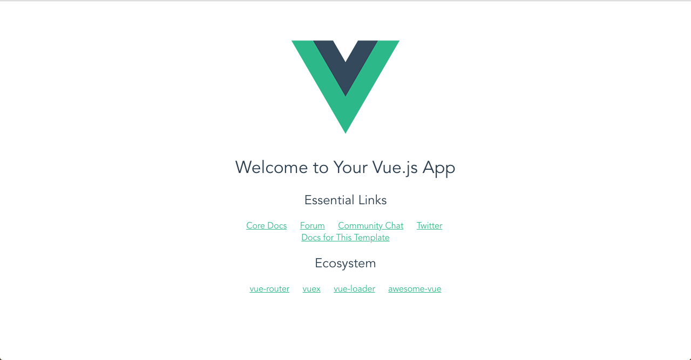

# Set up Vue.js Frontend 
## Prerequsites

- AWS Account
- IAM User with Administrator Access and Access Keys
- AWS CLI
```
$ aws --version
aws-cli/1.16.8 Python/2.7.10 Darwin/16.7.0 botocore/1.11.8
```
- Git
```
$ git --version
git version 2.14.3 (Apple Git-98)
```
- npm
```
$ npm -v
6.7.0
```

- vue-cli
```
$ $ npm install -global vue-cli eslint
$ vue --version 
2.9.6
```
- Docker
```
$ docker -v
Docker version 18.09.2, build 6247962
```


The  Project Layout will look like this:

```

```

## Step 1 Initialize a Basic Vue Application:

### Step 1.1: Create a CodeCommit Repository
```
$ aws codecommit create-repository --repository-name myproject-vuejs-web
```

### Step 1.2: Clone the repository
```
$ cd ~/environment
$ git clone https://git-codecommit.us-east-1.amazonaws.com/v1/repos/myproject-vuejs-web
```


### Step 1.3: Set up .gitignore
```
$ cd ~/environment/myproject-vuejs-web
$ vi .gitignore
```
```
# Logs
logs
*.log
npm-debug.log*
yarn-debug.log*
yarn-error.log*
lerna-debug.log*

# Diagnostic reports (https://nodejs.org/api/report.html)
report.[0-9]*.[0-9]*.[0-9]*.[0-9]*.json

# Runtime data
pids
*.pid
*.seed
*.pid.lock

# Directory for instrumented libs generated by jscoverage/JSCover
lib-cov

# Coverage directory used by tools like istanbul
coverage
*.lcov

# nyc test coverage
.nyc_output

# Grunt intermediate storage (https://gruntjs.com/creating-plugins#storing-task-files)

.grunt

# Bower dependency directory (https://bower.io/)
bower_components

# node-waf configuration
.lock-wscript

# Compiled binary addons (https://nodejs.org/api/addons.html)
build/Release

# Dependency directories
node_modules/
jspm_packages/

# TypeScript v1 declaration files
typings/

# TypeScript cache
*.tsbuildinfo

# Optional npm cache directory
.npm

# Optional eslint cache

.eslintcache

# Optional REPL history
.node_repl_history

# Output of 'npm pack'
*.tgz

# Yarn Integrity file
.yarn-integrity

# dotenv environment variables file
.env
.env.test

# parcel-bundler cache (https://parceljs.org/)
.cache

# next.js build output
.next

# nuxt.js build output
.nuxt

# vuepress build output
.vuepress/dist

# Serverless directories
.serverless/

# FuseBox cache
.fusebox/

# DynamoDB Local files
.dynamodb/
```

### Step 1.4: Test access to repo by adding README.md file and push to remote repository

```
$ cd ~/environment/myproject-vuejs-web
$ echo "myproject-vuejs-web" >> README.md
$ git add .
$ git commit -m "Adding README.md"
$ git push origin master
```

### Step 1.5: Navigate to working directory
```
$ cd ~/environment/myproject-vuejs-web
```

### Step 1.6:  Initialize Vue.js application
Walk through the instructions:
```
vue init webpack myproject-vuejs-web
```
```
? Project name myproject-vuejs-web
? Project description A Vue.js project
? Author Eddrich Janzzen Ang <eddrichang@gmail.com>
? Vue build standalone
? Install vue-router? Yes
? Use ESLint to lint your code? Yes
? Pick an ESLint preset Standard
? Set up unit tests Yes
? Pick a test runner jest
? Setup e2e tests with Nightwatch? Yes
? Should we run `npm install` for you after the project has been created? (recommended) npm

   vue-cli · Generated "myproject-vuejs-web".


# Installing project dependencies ...

.....
shortend this step
.....

# Project initialization finished!
# ========================

To get started:

  cd myproject-vuejs-web
  npm run dev

Documentation can be found at https://vuejs-templates.github.io/webpack
```

### Step 1.7:  Test Vue Application Locally
```
$ cd myproject-vuejs-web
$ npm run dev
```
```
> myproject-vuejs-web@1.0.0 dev /Users/eddrichjanzzenang/Desktop/myproject-vuejs-web/myproject-vuejs-web
> webpack-dev-server --inline --progress --config build/webpack.dev.conf.js

 13% building modules 29/31 modules 2 active ...s-web/myproject-vuejs-web/src/App.vue{ parser: "babylon" } is deprecated; we now treat it as { parser: "babel" }.
 95% emitting

 DONE  Compiled successfully in 5803ms                                                                                                                                   5:06:47 PM

 I  Your application is running here: http://localhost:8080
```
In your browser, go to:  
```
http://localhost:8080
```
You should see the ff:



### (Optional) Clean up
```
$ aws codecommit delete-repository --repository-name myproject-vuejs-web
$ rm -rf ~/environment/myproject-vuejs-web
```
